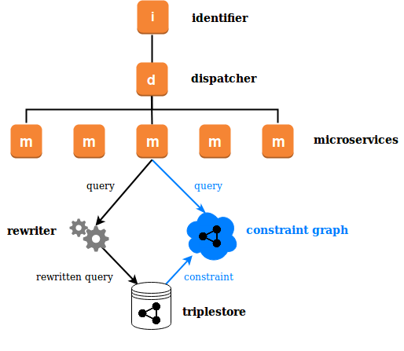

# Mu Query Rewriter

The Query Rewriter is a proxy service for enriching and constraining SPARQL queries before they are sent to the database. It functions as an authorization service in the [mu-semtech](http://mu.semte.ch) microservice architecture, enabling in-database access control and authorization-aware caching.

A sandbox interface for writing constraints is provided by https://github.com/big-data-europe/mu-query-rewriter-sandbox

A basic working example and testing environment is provided by https://github.com/big-data-europe/graph-acl-basics/

## Introduction 

A constraint is expressed as a standard SPARQL `CONSTRUCT` query, which conceptually represents an intermediate 'constraint' graph. An incoming query is optimally rewritten to a form which, when run against the full database, is equivalent to the original query being run against the constraint graph. Constraining queries in this way allows shared logic to be abstracted almost to the database level, simplifying the logic handled by each microservice. 



The main use case is modeling access rights directly in the data, so that an incoming query is effectively run against the subset of data which the current user has permission to query or update. Using Annotations (see below), the Rewriter can return authorization-aware cache-keys and clear-keys to the mu-cache. When access rights can be fully resolved at rewrite-time (using functional properties and intermediate queries, see below), the rewriter can return an error signaling no access. When access can only be resolved in the database, an unauthorized query will return the empty set.

There are also simpler use cases, such as using multiple graphs to model data so that individual microservices do not need to be aware of the rules determining which triples are stored in which graph. 

### Examples

In the following example, the constraint defines a model where bikes and cars are stored in separate graphs, and users can be authorized to see one or both of the types. 

When a microservice in the mu-semtech architecture (so the identifier has assigned a `mu-session-id`) makes the query, the rewriter will send the rewritten query the database.

<table>
 <thead>
  <tr>
   <th>Constraint</th>
   <th>Query</th>
   <th>Rewritten Query</th>
  </tr>
 </thead>
  <tr>
   <td>Functional properties: <code>rdf:type</code></td>
   <td></td>
   <td></td>
  </tr>
 <tr>
  <td>
<pre><code>
CONSTRUCT {
  ?a ?b ?c
}
WHERE {
  GRAPH ?graph {
   ?a ?b ?c;
      a ?type
  }
  GRAPH &lt;auth&gt; {
   &lt;SESSION&gt; muauth:account ?user.
   ?user muauth:authorizedFor ?type
  }
  VALUES (?graph ?type){
    (&lt;cars&gt; &lt;Car&gt;)
    (&lt;bikes&gt; &lt;Bike&gt;)
  }
}
</code></pre>
  </td>
  <td>
<pre><code>
SELECT *
WHERE {
  ?s a &lt;Bike&gt;;
     &lt;hasColor&gt; ?color.
}
</code></pre>
  </td>
  <td>
<pre><code>
SELECT ?s ?color
WHERE {
  GRAPH ?graph23694 {
    ?s a &lt;Bike&gt;;
       &lt;hasColor&gt; ?color.
  }
  GRAPH &lt;auth&gt; {
   &lt;session123456&gt; muauth:account ?user.
   ?user muauth:authorizedFor &lt;Bike&gt;
  }
  VALUES (?graph23694) { (&lt;bikes&gt;) }
}
</code></pre>
  </td>
 </tr>
</table>

If we want to query the `?user` at rewrite time, we declare `muauth:account` a transient functional property. ("Transient" means it is not cached between calls.) If the user is not authorized to see `<Bike>`s, this will be queried and known at rewrite time, and the query will fail before being sent to the database.

<table>
 <thead>
  <tr>
   <th>Constraint</th>
   <th>Query</th>
   <th>Rewritten Query</th>
  </tr>
 </thead>
  <tr>
    <td>Functional properties: <code>rdf:type</code>, <code>muauth:authorizedFor</code></td>
   <td></td>
   <td></td>
  </tr>
   <tr>
   <td>Transient functional properties: <code>muauth:account</code></td>
   <td></td>
   <td></td>
  </tr>
 <tr>
  <td>
<pre><code>
CONSTRUCT {
  ?a ?b ?c
}
WHERE {
  GRAPH ?graph {
   ?a ?b ?c;
      a ?type
  }
  GRAPH &lt;auth&gt; {
   &lt;SESSION&gt; mu:account ?user.
   ?user muauth:authorizedFor ?type
  }
  VALUES (?graph ?type){
    (&lt;cars&gt; &lt;Car&gt;)
    (&lt;bikes&gt; &lt;Bike&gt;)
  }
}
</code></pre>
  </td>
  <td>
<pre><code>
SELECT *
WHERE {
  ?s a &lt;Bike&gt;;
     &lt;hasColor&gt; ?color.
}
</code></pre>
  </td>
  <td>
<pre><code>
SELECT ?s ?color
WHERE {
  GRAPH ?graph23694 {
    ?s a &lt;Bike&gt;;
       &lt;hasColor&gt; ?color.
  }
  GRAPH &lt;auth&gt; {
   &lt;session123456&gt; mu:account &lt;user4532&gt;.
   &lt;user4532&gt; muauth:authorizedFor &lt;Bike&gt;
  }
  VALUES (?graph23694) { (&lt;bikes&gt;) }
}
</code></pre>
  </td>
 </tr>
</table>

## Running the Proxy Service

The Query Rewriter runs as a proxy service between the application and the database. It exposes a SPARQL endpoint `/sparql` that accepts GET and POST requests following the SPARQL specifications, and passes on all received headers to the database.

### Configuration

The Query Rewriter supports the following environment variables:

- `MU_SPARQL_ENDPOINT`: SPARQL read endpoint URL. Default: http://database:8890/sparql in Docker, and http://localhost:8890/sparql outside Docker.`.
- `MU_SPARQL_UPDATE_ENDPOINT`: SPARQL update endpoint. Same defaults as preceding.
- `PORT`: the port to run the application on, defaults to 8890.
- `PLUGIN`: plugin filename (without '.scm' extension), to be loaded from `/config` in Docker and `./config/rewriter` locally.
- `CACHE_QUERY_FORMS`: when "true" (default), will cache query forms. This feature is experimental (see below).
- `CALCULATE_ANNOTATIONS`: when "true" (default), annotations will be calculated and returned in the headers.
- `QUERY_ANNOTATIONS`: when "true" (default), variable annotations will be queried in the database.
- `SEND_DELTAS`: when "true" and a subscribers.json file is provided, will send deltas.
- `DEBUG`: when "true", run Scheme code interpreted.
- `DEBUG_LOGGING`: when "true", turn on verbose debug logging (mostly timing and performance).
- `MESSAGE_LOGGING`: turns basic logging on or off.
- `PRINT_SPARQL_QUERIES`: when "true", print all SPARQL queries.

These can also be set in the plugin file using the Scheme API below.


### Example docker-compose file

```
version: "2"
services:
  db:
    image: tenforce/virtuoso:1.0.0-virtuoso7.2.4
    environment:
      SPARQL_UPDATE: "true"
      DEFAULT_GRAPH: "http://mu.semte.ch/application"
    ports:
      - "8890:8890"
    volumes:
      - ./data/db:/data
  rewriter:
    image: nathanielrb/mu-graph-rewriter
    links:
      - db:database
      - laq:laq
    environment:
      DEBUG_LOGGING: "true"
      PLUGIN: "authorization"
    volumes:
      - ./config/rewriter:/config
    ports:
      - "4027:8890"
  my-service:
    image: my/service
    links:
      - rewriter:
  laq: # to test deltas
    image: flowofcontrol/list-all-requests

```

## Basic Logic

A constraint is expressed as a SPARQL `CONSTRUCT` statement of one triple, called the "matched triple".

## Annotations

Annotations are used to define application-specific cache-keys and clear-keys for the mu-cache. They are defined as an extension to the SPARQL 1.1 standard, and can take two forms, constant annotations: `@access Label` and variable annotations: `@access Label(?var)`. 

```
{
 ?a ?b ?c.
 ?a rdf:type ext:Comment.
 {
  @access adminComment
  ?user muauth:hasRole <http://ex/admin>.
}
UNION
{
 ?a ?b ?c.
 ?a rdf:type ?type.
 VALUES ?type { ext:Route ext:Hotel }
 {
  @access adminObject(?type)
  ?user muauth:hasRole <http://ex/admin>.
 }
```

Two headers are returned. `mu-cache-annotations` reports constant annotations, and variable annotations along with all possible values as known at rewrite time (not querying the database). `mu-queried-cache-annotations` reports actual values of variable  annotations in the database.

```
Mu-Cache-Annotations: "adminComment,adminObject <http://mu.semte.ch/vocabularies/ext/Route> <http://mu.semte.ch/vocabularies/ext/Hotel>"
Mu-Queried-Cache-Annotations: "adminObject <http://mu.semte.ch/vocabularies/ext/Route>,adminObject <http://mu.semte.ch/vocabularies/ext/Hotel>"
```

## Deltas

When the `SEND_DELTAS` parametre is "true" and a subscribers.json file is provided (see example in ./config/rewriter/subscribers.json), deltas are sent on all update queries.

The deltas are sent as JSON, following the format established by the [mu-delta-service](https://github.com/mu-semtech/mu-delta-service):

```
[
 {
  "graph":"http://mu.semte.ch/application",
  "delta": {
   "inserts":[
     {
      "s":"http://data-hub.toerismevlaamsbrabant.be/hotels/5B0C1AA33C7DF9000C000003",
      "p":"http://mu.semte.ch/vocabularies/ext/addedBy",
      "o":"http://data-hub.toerismevlaamsbrabant.be/users/5B0C193C3C7DF9000C000001"
     }
   ]
  }
 }
]
```

## Cache Forms


## Limitations and Exceptions

Due to the complexity of the SPARQL 1.1 grammar, not all SPARQL queries are fully supported.

The property paths `*`, `+` and `?` are constrained identically to the corresponding single-jump triple, e.g., `?s ?p* ?o` is considered subject to the same constraints as `?s ?p ?o`.

## Writing Plugins

The [mu-query-writer-sandbox](https://github.com/big-data-europe/mu-query-rewriter-sandbox) provides a UI for writing and testing Query Rewriter plugins. The [graph-acl-basics](https://github.com/big-data-europe/graph-acl-basics/) repository provides a full working example for experimentation.

This section describes how to write plugins directly in Chicken Scheme. 

### API

**[procedure]** `(define-constraint mode constraint)` 

`mode` is a symbol, and can take the values `'read/write`, `'read` or `'write`

`constraint` can be a string or a procedure of zero arguments returning a string.

**[parameter]** `*functional-properties*`

A list of IRIs (symbols) of properties which, for any given subject, can only have one value.

**[parameter]** `*query-functional-properties?*

#t or #f. Query the database directly for values of functional properties, when the subject is an IRI.

**[parameter]** `*unique-variables*`

A list of variables (symbols) which are considered unique for a single query, and therefore not rewritten.

**[parameter]** `*headers-replacements*`

List of template forms for the constraint query that will be replaced dynamically with the matching header. Each element takes the form `'(("<TEMPLATE>" header-name string))` or `'(("<TEMPLATE>" header-name uri))`. Defaults to `'(("<SESSION>" mu-session-id uri))`.

### Example 

```
(*functional-properties* '(rdf:type))

(*query-functional-properties?* #t)

(*unique-variables* '(?user))

(define-constraint  
  'read/write 
  (lambda ()    "
PREFIX mu: <http://mu.semte.ch/vocabularies/core/>
PREFIX graphs: <http://mu.semte.ch/school/graphs/>
PREFIX school: <http://mu.semte.ch/vocabularies/school/>
PREFIX foaf: <http://xmlns.com/foaf/0.1/>

CONSTRUCT {
 ?a ?b ?c.
}
WHERE {
 GRAPH <authorization> {
  <SESSION> mu:account ?user
 }
 GRAPH ?graph {
  ?a ?b ?c.
  ?a rdf:type ?type.
 }
 VALUES (?graph ?type) { 
  (graphs:grades school:Grade) 
  (graphs:subjects school:Subject) 
  (graphs:classes school:Class) 
  (graphs:people foaf:Person) 
 }
}  "))
```
